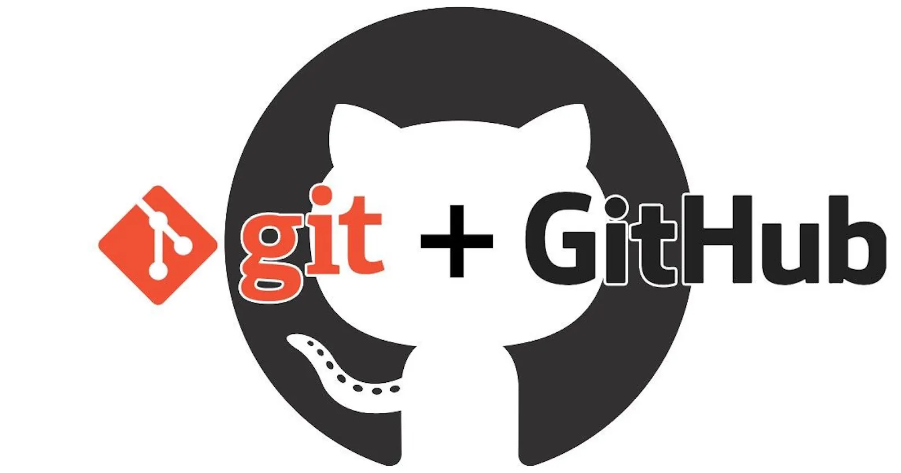

# Подсказка по Git
**Git** — это система контроля версий, которая помогает отслеживать историю изменений в файлах.
Git используют программисты для совместной работы над проектами.

К базовым возможностям Git относятся:
* возврат к любой предыдущей версии кода;
* просмотр истории изменений;
* параллельная работа над проектом;
* backup кода.

### ***Создания репозитория:***
```sh
git init
```
Инициализация/Создание в текущей папки рабочего места (*папки с конфигурационными файлами*) для Git.

### ***Отоброжение статуса текущего репозитория:***
```sh
git status
```
Состояние на директории (главной ветке древа) процессов.

### ***Добавить к отслеживанию:***
```sh
git add
```
Добавить примененные изменеия с файлом, проиндексировать данный процесс.

### ***Зафиксиривоть изменения:***
```sh
git commit -m "Message text"
```
Сохранить добавленные изменения, прокомментировав процесс действий и получив __hashCode__.

### ***Вывод Процессов***
```sh
git log
```
Журнал (_индификатор_) изменений в системе Git, содержащий сведения о последовательности изменений, отображающий **hashCode** зафиксированных действий (*изменений*), автора, время зафиксированных действий (*изменений*) и комментарии к ним.

### ***Ключ Вывода Процессов***
```sh
git log --oneline
```
Упрощенный индификатор (_журнал_) изменений в системе Git, содержащий последовательность состояний файла, сокращённые __hashCodes__ и комментарии к ним.

### ***Ключ Графического Вывода Процессов***
```sh
git log --graph
```
Древовидный граф слева, помогает визуализировать изменения в ветках проекта (__файла__).

### ***"Назад в Будущее"***
```sh
git checkout <hashСode>
```
Переход к состоянию процесса по его __hashCode__.

### ***"Назад в Будущее. Исходник"***
```sh
git checkout <master> /or/ <main>
```
Возвращение в главное состояние процесса (*в последнее зафиксированное изменение*).

### ***Разница***
```sh
 command+S git diff 
 
 git diff <hash> <hash>
```
Команда для обозрения изменений в текущем процессе.
И команда для сравнения разницы между изменениями в процессах по их __hashCodes__.

### ***Отоброжене всех веток***
```sh
git branch
```
Команда для управления ветками в репозитории Git. 

### ***Создание новой ветки***
```sh
git branch <new_branch_name>
```
Команда для создания новой ветки в текущей ветке.

### ***Удаление ветки***
```sh
git branch -d <branch_name>
```
Команда для удаления отработанной ветки. **"-D"** беззаговорочное удаление ветки.

### ***"Назад в Будущее. Ветки"***
```sh
git checkout branch
```
Переход на актуальную директиву (_ветку_) рабочего проекта.

### ***Слияние***
```sh
git merge branch <name>
```
Выполняет слияние отдельных направлений выполненных(_закоммиченных_) процессов в единую ветку. 
При слияние возможен conflict, вызванный разными изменениями на одной и тойже строчке.

## ***GiitHub***
**GitHub** - это многофункциональная платформа для командной работы над проектом.

Она состоит из:
1. Облачного хранилища, в котором размещаются все файлы.
2. Социальной сети для разработчиков.
3. Системы контроля версий, фиксирующей все редакции, вносимые в код тем или иным участником.

*GitHub* позволяет:
* разместить общий проект;
* совместно управлять всеми измененниями;
* быстро вернуться к исправной версии в случае неудачи.

## _"Долли"_
```sh
git clone <https://github.com/name_account/name_project.git>
```
Команда для создания копии репозитория.

## *"Толкай"*
```sh
git push
git push origin
git push origin --delete <branch_name>
```
Консольная команда позволяет передать изменения из локального репозитория (набор файлов из папки .git) в удаленный.

_Цель использования этой команды:_
* Добавить новый функционал в основную ветку;
* исправить баг;
* закрыть уязвимость в коде и др.

origin -  это сокращенное имя удаленного репозитория, из которого изначально был клонирован проект (__*вместо URL*__).

origin --delete - команда позоляющая удалить _удаленную_ ветку.

## *"Тени"*
```sh
git pull
git pull --rebase
```
Команда используется для извлечения и загрузки содержимого из удаленного репозитория и немедленного обновления локального репозитория этим содержимым.
> Представляет собой комбинацию двух команд: __git fetch__ и **git merge**.

_**--rebase**_ выполняет перебазирование текущей ветки на самый новый коммит вместо создания слияния (merge).

## *"Связь"*
```sh
git remote show
git remote -v
```
Команда, которая помогает управлять набором репозиториев, ветви которых отслеживаются.

-v выводит список всех удаленных репозиториев для локального репозитория Git.

